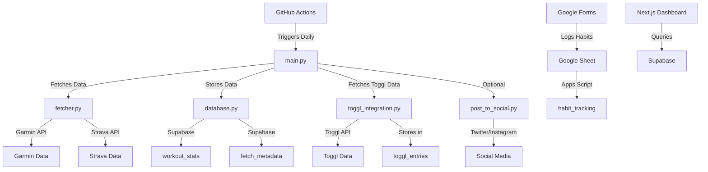

# My Daily Proof


A personal dashboard that integrates fitness data from Garmin and Strava, time-tracking data from Toggl, and habit tracking via Google Forms. Data is stored in a Supabase/PostgreSQL database and visualized through a responsive Next.js dashboard.

By making fitness, time management, and habit data public, this project aims to promote accountability and continuous improvement.

## Inspiration

This dashboard is influenced by several thought leaders:

- **Naval Ravikant**: Prioritizing health, learning, and deep work as foundational elements for personal growth.
- **Peter Attia**: Focusing on fitness metrics like VO2 max and other longevity indicators to optimize long-term health.
- **Balaji Srinivasan**: Implementing a "Proof of Workout" concept for public accountability in fitness and productivity.
- **James Clear**: Emphasizing small, consistent habits through public habit tracking to drive meaningful change.

## Features

- **Overview Dashboard**: At-a-glance view of key metrics and recent activities
- **Fitness Tracking**: Workout history, VO2 max trends, activity types, and workout statistics
- **Time Management**: Visualization of time spent across different categories (Deep Work, Learning, etc.)
- **Habit Monitoring**: Habit streaks, completion rates, and yearly habit calendar view
- **Responsive Design**: Mobile and desktop-friendly interface with dark theme
- **Offline Fallbacks**: Graceful degradation with fallback data when database is unavailable

## Architecture

### Data Flow



### Directory Structure

```
my-daily-proof/
├─ .github/workflows/          # GitHub Actions workflows
│  ├─ daily_workout.yml        # Daily data fetching job
│  └─ vercel-deploy.yml        # Vercel deployment job
├─ scripts/                    # Python scripts
│  ├─ config.py                # Environment configuration
│  ├─ database.py              # Database operations
│  ├─ fetcher.py               # Garmin data fetching
│  ├─ strava_fallback.py       # Strava fallback fetching
│  ├─ toggl_integration.py     # Toggl time tracking
│  ├─ vo2max.py                # VO2 max tracking
│  ├─ habit_fetcher.py         # Habit data processing
│  └─ main.py                  # Main orchestration script
├─ web/                        # Next.js dashboard
│  ├─ components/              # React components
│  │  ├─ panels/               # Dashboard panels
│  │  │  ├─ OverviewPanel.js   # Main dashboard view
│  │  │  ├─ FitnessPanel.js    # Fitness metrics view
│  │  │  ├─ TimePanel.js       # Time tracking view
│  │  │  └─ HabitsPanel.js     # Habits tracking view
│  │  └─ ui/                   # UI components
│  ├─ pages/                   # Next.js pages
│  │  ├─ api/                  # API routes
│  │  ├─ index.js              # Main dashboard
│  │  ├─ fitness.js            # Fitness page
│  │  └─ habits.js             # Habits page
│  ├─ utils/                   # Utility functions
│  │  ├─ supabaseClient.js     # Supabase client
│  │  └─ fallbackData.js       # Offline fallback data
│  ├─ styles/                  # CSS styles
│  ├─ package.json             # Node.js dependencies
│  └─ next.config.js           # Next.js configuration
└─ requirements.txt            # Python dependencies
```

## Technology Stack

- **Backend**:
  - Python 3.10+
  - Supabase PostgreSQL
  - GitHub Actions for automation
  
- **Data Sources**:
  - Garmin Connect API
  - Strava API (fallback)
  - Toggl API
  - Google Forms/Sheets
  
- **Frontend**:
  - Next.js
  - React
  - Tailwind CSS
  - Chart.js / react-chartjs-2

## Setup & Installation

### 1. Clone the Repository

```bash
git clone https://github.com/yourusername/my-daily-proof.git
cd my-daily-proof
```

### 2. Python Dependencies

Install the required Python packages:

```bash
pip install -r requirements.txt
```

### 3. Supabase Setup

1. Create a Supabase project at [supabase.com](https://supabase.com)
2. Create the following tables:
   - `workout_stats`: Stores workout data
   - `fetch_metadata`: Tracks data fetch status
   - `toggl_entries`: Stores time tracking data
   - `vo2max_tests`: Stores VO2 max readings
   - `habit_tracking`: Stores habit data

### 4. Environment Variables

Create a `.env` file in the root directory with the following variables:

```
# Garmin
GARMIN_USERNAME=your_garmin_username
GARMIN_PASSWORD=your_garmin_password

# Strava
STRAVA_CLIENT_ID=your_strava_client_id
STRAVA_CLIENT_SECRET=your_strava_client_secret
STRAVA_REFRESH_TOKEN=your_strava_refresh_token

# Supabase
SUPABASE_URL=your_supabase_url
SUPABASE_KEY=your_supabase_anon_key
SUPABASE_DB_HOST=your_supabase_db_host
SUPABASE_DB_PORT=your_supabase_db_port
SUPABASE_DB_NAME=your_supabase_db_name
SUPABASE_DB_USER=your_supabase_db_user
SUPABASE_DB_PASSWORD=your_supabase_db_password

# Toggl
TOGGL_API_KEY=your_toggl_api_key

# Optional: Social Media
TWITTER_API_KEY=your_twitter_api_key
TWITTER_API_SECRET=your_twitter_api_secret
TWITTER_ACCESS_TOKEN=your_twitter_access_token
TWITTER_ACCESS_SECRET=your_twitter_access_secret
```

### 5. Next.js Setup

```bash
cd web
npm install
```

### 6. GitHub Actions Setup

Add the environment variables as GitHub repository secrets to enable automated data collection.

## Usage

### Manual Data Collection

Run the Python script to fetch and store data:

```bash
python -m scripts.main
```

### Starting the Dashboard

```bash
cd web
npm run dev
```

Visit `http://localhost:3000` to view the dashboard.

### Production Deployment

The project can be deployed to Vercel or GitHub Pages:

1. Connect your GitHub repository to Vercel
2. Configure the environment variables in Vercel
3. Deploy the Next.js app

## Data Sources Setup

### Garmin Connect

Requires a Garmin Connect account. Credentials are used to fetch activity data through the unofficial API.

### Strava

1. Create a Strava API application at [strava.com/settings/api](https://www.strava.com/settings/api)
2. Generate refresh token using OAuth 2.0 flow
3. Configure the tokens in environment variables

### Toggl

1. Create a Toggl account
2. Get your API token from [track.toggl.com/profile](https://track.toggl.com/profile)
3. Configure your projects to map to "buckets" (Deep Work, Learning, etc.)

### Habit Tracking

1. Create a Google Form for daily habit tracking
2. Set up Google Apps Script to send data to Supabase

## Contributing

Contributions are welcome! Please feel free to submit a Pull Request.

## License

This project is licensed under the MIT License - see the LICENSE file for details.

## Acknowledgments

- Naval Ravikant, Peter Attia, Balaji Srinivasan, and James Clear for inspiration
- Open-source libraries and APIs that made this project possible
