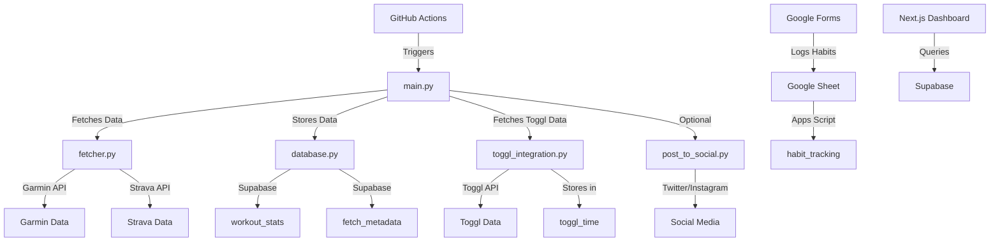

# My Daily Proof

This project is a personal dashboard that integrates fitness data from Garmin and Strava, time-tracking data from Toggl, and habit tracking via Google Forms. The data is stored in a Supabase/Postgresql database and visualized through a Next.js dashboard. The project is automated using GitHub Actions to ensure daily updates.

By making my fitness, time management, and habit data public, I aim to stay accountable and continuously improve. The dashboard is influenced by:
- **Naval Ravikant's ideals** on prioritizing health, learning, and deep work as key pillars of a meaningful life. These ideals shape the focus on tracking time spent on fitness, learning, and focused work.
- **Peter Attia's focus** on fitness metrics like VO2 max, strength, and other longevity indicators, which are tracked and visualized in the dashboard to monitor long-term health.
- **Balaji Srinivasan's "Proof of Workout"** concept, which emphasizes public accountability for fitness and productivity by sharing progress transparently.
- **James Clear's Atomic Habits**, which highlights the power of small, consistent habits to drive self-improvement. This project makes habit data public to reinforce accountability.

---

## Directory Structure


---

my-daily-proof/
├─ .github/
│  └─ workflows/
│      └─ daily_workout.yml
├─ scripts/
│  ├─ config.py
│  ├─ database.py
│  ├─ fetcher.py
│  ├─ strava_fallback.py
│  ├─ vo2max.py
│  ├─ toggl_integration.py
│  ├─ main.py
│  ├─ post_to_social.py
│  └─ screenshot_chart.js
├─ web/
│  ├─ package.json
│  ├─ pages/
│  │   ├─ api/
│  │   ├─ index.js
│  │   ├─ toggl.js
│  │   └─ habits.js
│  └─ …
├─ requirements.txt
└─ README.md


---

## Project Flow Diagram


---
Python Scripts and Functions
config.py
Purpose: Loads environment variables from a .env file for local use or from GitHub Actions secrets in CI.
Functions:
No functions; defines variables like GARMIN_USERNAME, SUPABASE_DB_HOST, etc.
database.py
Purpose: Manages database connections and operations for Supabase.
Functions:
get_db_connection(): Establishes a connection to the Supabase database.
get_last_successful_fetch_date(conn): Retrieves the most recent successful fetch date.
update_last_successful_fetch_date(conn, date_val): Updates the fetch log with the latest fetch date.
store_workout_data(conn, activity): Inserts or updates workout data in the workout_stats table.
fetcher.py
Purpose: Retrieves fitness data from Garmin, with Strava as a fallback.
Functions:
fetch_garmin_daily(conn): Fetches Garmin activities since the last successful fetch or 7 days ago, filtering out duplicates.
strava_fallback.py
Purpose: Fetches data from Strava if Garmin data retrieval fails.
Functions:
strava_fetch_daily(): Retrieves the latest Strava activity as a fallback.
vo2max.py
Purpose: Handles VO2 max data storage and retrieval.
Functions:
create_vo2max_table_query(): Generates SQL to create the vo2max_tests table.
insert_vo2max(conn, test_date, vo2max_value, notes): Adds or updates VO2 max records.
get_latest_vo2max(conn): Fetches the most recent VO2 max value.
toggl_integration.py
Purpose: Integrates Toggl time-tracking data, mapping it to "Naval buckets" (e.g., Health/Fitness, Deep Work).
Functions:
bucket_for_project_or_tags(project_name, tags): Maps projects or tags to a Naval bucket.
fetch_toggl_entries(since_days=7): Retrieves Toggl entries from the last since_days.
aggregate_by_bucket_daily(entries): Aggregates entries by date and bucket.
store_toggl_data(conn, daily_buckets): Stores aggregated data in the database.
fetch_and_store_toggl_data(conn, since_days=7): Manages the full Toggl fetch-and-store process.
main.py
Purpose: Orchestrates data fetching, storage, and optional social media posting.
Functions:
main(): Runs the entire process: fetching Garmin data, storing it, fetching Toggl data, and updating the fetch log.
post_to_social.py
Purpose: Posts updates to Twitter and Instagram.
Functions:
post_twitter(image_path, message): Posts an image and message to Twitter.
post_instagram(image_path, message): Posts an image and message to Instagram.
main(): CLI entry point for social media posting.


## Setup & Installation

### 1. Clone the Repository

```bash
git clone https://github.com/egericke/Proof_Of_Work_r0.git
cd Proof_Of_Work_r0

2. Python Dependencies
Install the required Python packages:

pip install -r requirements.txt
- Requires Python 3.9 or higher.
- For local development, create a .env file with your credentials (optional if running only on GitHub).

3. Node Dependencies

Install the Next.js dashboard dependencies:
cd web
npm install

- Installs Next.js, React, Chart.js, and Supabase client libraries.

GitHub Actions & Secrets
- Navigate to your GitHub repository: Settings → Secrets and variables → Actions.
- Add the following secrets:
- GARMIN_USERNAME, GARMIN_PASSWORD
- STRAVA_CLIENT_ID, STRAVA_CLIENT_SECRET, STRAVA_REFRESH_TOKEN
- SUPABASE_DB_HOST, SUPABASE_DB_PORT, SUPABASE_DB_NAME, SUPABASE_DB_USER, SUPABASE_DB_PASSWORD
- TOGGL_API_KEY
- (Optional, later) Twitter/Instagram credentials for social posting
- The .github/workflows/daily_workout.yml file uses these as environment variables.


Usage

Daily Cron: GitHub Actions runs daily (configured in daily_workout.yml via on.schedule.cron). It:
1. Fetches Garmin and Strava data from the last few days.
2. Stores only new data in Supabase.
3. Fetches Toggl data.
4. (Future) Builds the Next.js site, screenshots it, and posts to social media if credentials are provided.

Local Testing
- Run python -m scripts.main to test the data-fetching script.
- Run cd web && npm run dev to launch the Next.js dashboard locally.

Database Setup
The database schema is managed in database.py. The script interacts with the following tables:

workout_stats: Stores Garmin activity data.
fetch_metadata: Tracks the last successful fetch date to ensure only new data is fetched and stored.
toggl_time: Stores aggregated Toggl time entries by bucket.
Ensure the fetch_metadata table exists in Supabase. If not, run:
CREATE TABLE fetch_metadata (last_fetch_date DATE);


## Data Fetching
The fetcher.py script fetches Garmin activities from the last successful fetch date (or 7 days ago if no previous fetch). It filters out activities already stored in the database to avoid duplicates.

## Toggl Integration
The toggl_integration.py script fetches Toggl time entries from the last 7 days, aggregates them by "Naval buckets" (e.g., Health/Fitness, Deep Work), and stores them in the toggl_time table. It uses the TOGGL_API_KEY from scripts.config for authentication.

## Running the Script

python -m scripts.main

This will:
- Fetch and store new Garmin activities.
- Fetch and store Toggl time entries.
- Update the fetch log with the current date.
- For GitHub Actions, the workflow runs daily, fetching and storing new data automatically.

## Google Forms & Habits
A Google Form logs habits to a Google Sheet.
A Google Apps Script sends new submissions to Supabase’s habit_tracking table.
Contributing
Fork and adapt the project as needed.
Submit issues or pull requests for improvements.

## License
Licensed under the MIT License (or choose your preferred license upon open-sourcing).

## Final Notes
Keep requirements.txt at the project root for Python dependencies.
Keep package.json (and package-lock.json after npm install) in web/.
This README guides setup and usage—update it as the project evolves.

## Background & Influences
This project draws inspiration from:

Naval Ravikant: Prioritizing health, learning, and deep work as foundational elements of personal growth. The dashboard tracks time spent on these areas to align with Naval's ideals.
Peter Attia: Tracking fitness metrics like VO2 max, strength, and other longevity indicators to optimize health over the long term. These metrics are visualized in the dashboard for continuous monitoring.
Balaji Srinivasan: Public accountability through the "Proof of Workout" concept, encouraging transparency in fitness and productivity efforts by sharing progress publicly.
James Clear's Atomic Habits: Emphasizing small, consistent habits to drive meaningful change. By making habit data public, this project reinforces accountability and encourages steady improvement.
